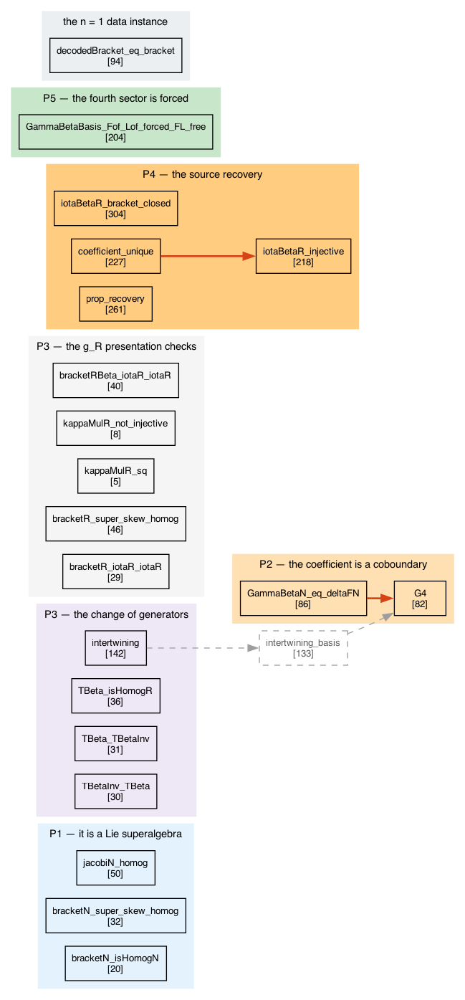
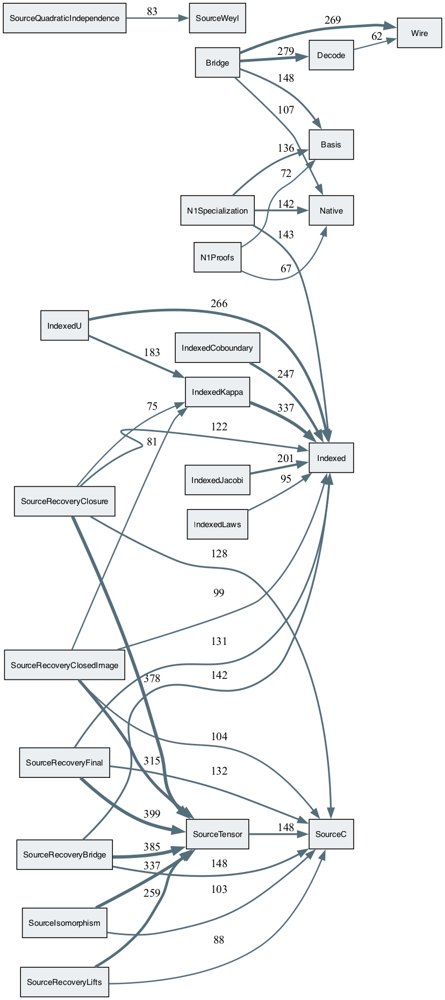

# Part 1 — What you will see

## 1.1 The build's own report

`lake build InhomogeneousDeformations` prints one line per audited declaration.
Counted from the transcript:

```
649   declarations audited
634   depend on axioms
 15   depend on none
  0   sorryAx
  0   errors
```

and, by which axioms:

```
603   [propext, Classical.choice, Quot.sound]
 16   [propext, Quot.sound]
 15   [propext]
```

## 1.2 Six of those lines, verbatim

The result the paper calls Theorem 4.1 (`Γ_β = δ f_β`):

```
info: .../AxiomAudit.lean:436:0: 'InhomogeneousDeformations.Indexed.GammaBetaN_eq_deltaFN' depends on axioms: [propext, Classical.choice, Quot.sound]
```

The change of generators, and that it intertwines the brackets:

```
info: .../AxiomAudit.lean:507:0: 'InhomogeneousDeformations.Indexed.TBetaInv_TBeta' depends on axioms: [propext, Classical.choice, Quot.sound]
info: .../AxiomAudit.lean:546:0: 'InhomogeneousDeformations.Indexed.intertwining' depends on axioms: [propext, Classical.choice, Quot.sound]
```

The recovery from the oscillator source (Proposition 3.1):

```
info: .../AxiomAudit.lean:951:0: 'InhomogeneousDeformations.Source.prop_recovery' depends on axioms: [propext, Classical.choice, Quot.sound]
```

One of the fifteen that need no axiom at all:

```
info: .../AxiomAudit.lean:249:0: 'InhomogeneousDeformations.Bridge.T5_module_id' does not depend on any axioms
```

And one printed wrapped, which is why the counting recipe in `README.md` joins
lines before matching:

```
info: .../AxiomAudit.lean:1046:0: 'InhomogeneousDeformations.Source.GammaBetaBasis_Fof_Lof_forced_FL_free' depends on axioms: [propext,
 Classical.choice,
 Quot.sound]
```

## 1.3 The dependency graph

Running the extractor against the same build (`structure/extract.lean`) prints:

```
nodes 1081  edges 11450
```

and writes `nodes.tsv`, `edges.tsv`: every declaration of the development, and
every *real* dependency between them — real in the sense that compiler-generated
auxiliaries are passed through rather than counted.

---

# Part 2 — What the audit means

## 2.1 What `#print axioms` actually checks

It is not a declaration of intent and not a lint. Lean takes the finished proof
term, walks every constant it uses, transitively, through every lemma those use,
and reports the axioms at the bottom. A result's line is a statement about the
**whole** derivation behind it, not about the file it was written in.

This is why the report is 649 lines rather than 5: each of the paper's claims is
carried by a named declaration, and the supporting lemmas are audited too, so the
reader can see that nothing in the chain was left open.

## 2.2 The three axioms, and why they are not a caveat

`propext` (propositional extensionality), `Classical.choice` (the axiom of
choice), and `Quot.sound` (soundness of quotient types) are the standard axioms of
Lean's logic. They are what makes Lean's foundation classical mathematics rather
than a constructive fragment; essentially every mathlib development depends on
them. Depending on them is the ordinary state of a formalized theorem, not a
weakening of it.

What would be a caveat is a *fourth* entry — an `axiom` declared by this
development to assume something it could not prove. There is none: the profile
table above has three rows and no others.

**The fifteen that depend on nothing** are not stronger theorems; they are
statements whose proofs are computations Lean carries out by definitional
unfolding. All fifteen are in the `Bridge` module — the rank-1 data-instance
checks: ten `T5_*` structural identities, two `pos*_valid` acceptances, and three
`neg*_rejected` well-formedness rejections (`negBadDen_rejected`,
`negUnreduced_rejected`, `negWrongLen_rejected`). Nothing in the general-rank
development is among them, and nothing should be: real theorems about a
polynomial ring use the logic. The module's other eleven `*_rejected`
declarations do depend on `propext`, so "axiom-free" here is a fact about which
proofs reduce to computation, not a grading of the checks.

## 2.3 `sorryAx` — the one that carries the weight

`sorry` is Lean's placeholder for an unfinished proof. It elaborates, so a file
full of `sorry` still *builds*; what it does is poison the proof term with the
axiom `sorryAx`, which then propagates to everything downstream. A single
occurrence anywhere under a result would mean that result is assumed, not proved.

```
grep -c 'sorryAx' audit.txt   # 0
```

That zero is the load-bearing number in the whole report. Everything else
describes *which* logic was used; this one says the logic was actually completed.

## 2.4 What the audit does **not** tell you

It says every audited declaration is proved. It says nothing about whether those
declarations state what the paper says they state. **That binding is made
elsewhere, by hand**: Appendix A.3 of the paper is a table pairing each claim with
the declaration that carries it, by fully qualified name, with a link into this
repository at the tagged commit. The audit and the table are two halves of one
argument — the table says *which* statement, the audit says *that* it is proved.
Checking the first is reading; checking the second is the command above.

---

# Part 3 — What Layer B adds

The audit answers "is it proved?". The dependency graph answers a different
question: **"what did the proof actually use?"** — which is not always what the
prose suggests, and is worth measuring rather than assuming.

## 3.1 The anti-circularity gate

The sharpest use of the graph in this development is a check on the result the
paper calls *the fourth sector is forced* (Appendix A.2, item P5).

The claim there is delicate: the `(F,L)` value of `Γ_β` is **carried as a
definition**, and P5 says the concrete algebra admits no other value. A proof of
that which reached the definition carrying the value would be reading back its own
answer. So the condition under which P5 was accepted was that its proof term must
nowhere reach `GammaBetaBasis`.

Measured on the graph, from a fresh build and an independently written extractor:

| target | reachable from P5 |
|---|---|
| `GammaBetaBasis` | no |
| `GammaBetaBasis_Fof_Lof` | no |
| `GammaBetaBasis_Lof_Fof` | no |
| `GammaBetaBasis_Lof_Lof` | no |
| `GammaBetaBasis_degree0` | no |

The gate holds. This is the kind of property that cannot be seen by reading the
source and cannot be seen in the axiom audit either; it needs the graph.

## 3.2 Where the theorem and the proposition meet — read this carefully

The paper's Theorem 4.1 cites Proposition 3.1. In the formalization the two
groups of declarations are **mutually unreachable**: the theorem's proof term does
not reach the proposition's, and the proposition's does not reach the theorem's.
They share 55 supporting declarations — 35 definitions and 20 lemmas about them —
out of 165 and 377 respectively.

**This is not a gap, and the paper already says so.** The two results meet at the
*definition* of the coefficient `Γ_β`, not at a theorem: the coboundary identity is
proved about the defined `Γ_β`, the recovery is proved about the same defined
`Γ_β`, and neither is derived from the other. The theorem's citation of the
proposition **names the theorem's subject** — "the coefficient in
Proposition 3.1 satisfies …" — it does not claim the proof descends from it. A
statement-level dependency and a proof-term edge are different relations.

What the measurement establishes is that two sentences of the appendix are
accurate: A.1's "transcribed from their statements above rather than derived", and
A.2's "By item P4 the coefficient they concern is the one recovered from the
oscillator source, so no identification is left to the reader". The disclosure was
already correct; the graph verifies it.

*(This paragraph exists because the finding was once read the other way round, as
a contradiction between paper and formalization, and it is not one. Anyone
re-running the extractor will meet the same shape and deserves the framing with
it.)*

## 3.3 The shape of the development



*The twenty declarations Appendix A.3 names, grouped by the claim each carries.
The bracketed number on a declaration is how many distinct declarations its proof
term reaches, transitively. **Solid red** is a direct dependency; **dashed grey**
is a one-hop transitive one, drawn through the intermediate that realises it.
Regenerate it yourself: run `tools/extract.lean` and read `edges.tsv`.*

168 ordered module pairs carry at least one edge, 140 of them between *distinct*
modules. The heaviest are
`SourceRecovery*  →  SourceTensor` and `Indexed*  →  Indexed`: two foundations,
with the source-side family resting on the first and the coordinate-side family on
the second. The rank-1 data-instance branch (`Bridge`, `Decode`, `Wire`,
`FixtureData`) sits apart — **no** edge runs from a general-rank module into any of
those four, so the general results do not quietly depend on the one worked example.

The paper reads as a chain; the development is a fan. Among the twenty
declarations Appendix A.3 names, `edges.tsv` contains exactly **two** direct
edges: `GammaBetaN_eq_deltaFN → G4` and `coefficient_unique → iotaBetaR_injective`.
(`intertwining` reaches `G4` too, but through one intermediate lemma,
`intertwining_basis` — transitively, not directly.) **The five claims are, in the
proof terms, largely independent of one another** — which is the reason each can
be read, and doubted, separately.

That is what the figure above shows: seven groups, and two solid arrows between
them.



*The module-level view. An arrow carries the number of declaration-to-declaration
dependencies behind it, and only pairs above sixty are drawn — so `FixtureData`,
whose edges into `Decode` and `Wire` number two and seven, does not appear here
even though it belongs to the rank-1 branch. Every weight shown was checked
against `edges.tsv`.*

---

# Part 4 — The boundary, and how to check it yourself

The scope of what is established is stated in the paper, in Appendix A.4, *What is
not formalized*, and in this repository's own *What is not established*. Those are
authoritative and are not repeated here. Two of the five entries are worth knowing
before reading the audit, because they explain lines you might otherwise look for
and not find: the source isomorphism is **realized concretely rather than
presented abstractly**, and the `(F,L)` value is **carried as a definition** — §3.1
above is the check that makes the second one safe.

A sceptical reader can work down this list; each step is stronger than the one
above it.

1. **Read the audit's counts.** One command. Establishes: nothing is assumed.
2. **Read Appendix A.3's table** against the declaration names in the audit.
   Establishes: the things proved are the things claimed.
3. **Read the statements themselves** in the source, at the names A.3 gives.
   Establishes: the statements say what their English gloss says.
4. **Run the extractor** and query the graph. Establishes: what each proof really
   rests on — including §3.1's gate, which no amount of reading will show you.
5. **Re-derive the mathematics.** The paper is self-contained; the formalization
   is not a substitute for it, and Appendix A.4 records where the two differ in
   route.

Steps 1 and 4 are mechanical and take minutes. Steps 2 and 3 are reading, and are
where a formalization is actually accepted or rejected — a machine-checked proof
of the wrong statement is checked, and wrong.
